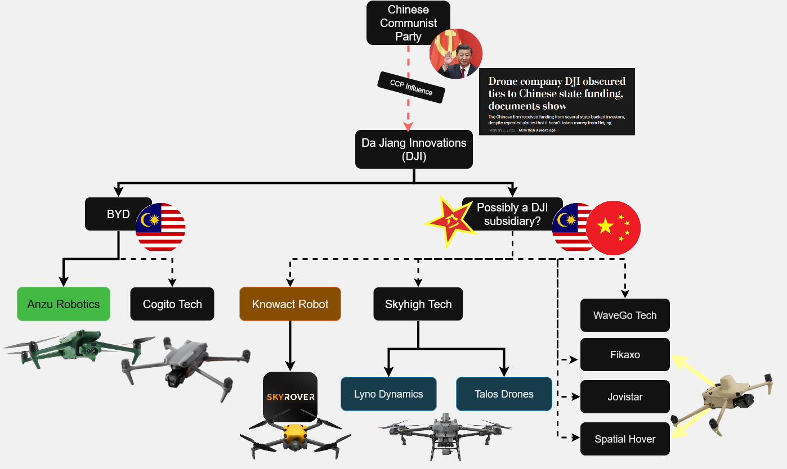

## The greatest heist ever pulled

## FCC Scraping operations are currently cancelled due to government shutdown.

How Chinese is a drone made by a Chinese company, running software developed in China, with chips made in China, with firmware updates hosted on a server controlled by a Chinese company, with Chinese IP, an with a remote controller which uses a mobile application developed by said Chinese company (with heavy anti reverse engineering obfuscation provided by a different... you guessed it... Chinese company!)

## House of DJI:

### Background:

DJI is the world's largest drone manufacturer with more than 70% of market share worldwide, per [some reports](https://blog.bccresearch.com/top-10-companies-leading-the-drone-technology-market).

In 2017 the [Department of Defense](https://www.defenseone.com/technology/2017/08/us-army-just-ordered-soldiers-stop-using-drones-chinas-dji/139999/?oref=defense_one_breaking_nl), and other US government agencies banned use of DJI drones, two years later the [Department of Interior](https://www.commercialuavnews.com/security/dji-drones-grounded-department-of-the-interior) followed suit.

It is undeniable DJI drones pose a threat to armed forces worldwide not only due to the fact that the company is headquartered in China, subject to Chinese laws (such as the infamous [security law](https://www.cna.org/quick-looks/2023/chinas-national-security-laws-implications-beyond-borders) that would force DJI to "report to and cooperate with PRC authorities, and they must assist with state-directed intelligence and counterintelligence efforts.") but also due to the carelessness displayed by their development team, wherein the data of all of their users was available to download by absolutely anyone who knew where to look, due to an exposed Amazon AWS S3 bucket. Ironically, [it was the PLA that actually ended up with their DJI pics online...](https://x.com/d0tslash/status/1766715841456779685).

DJI could be banned in the US by restricting their use of the electromagnetic spectrum, regulated by the FCC. As of 2025, it is a possibility that DJI ends up in the Covered List, just like ZTE and Huawei.

DJI is already listed as a [Chinese Military Company](https://media.defense.gov/2022/Oct/05/2003091659/-1/-1/0/1260HCOMPANIES.PDF) by the DoD.

So what did DJI do in the face of a possible ban?

Created shell companies. Lots of them.

Some are actually pretty legit, like Anzu. They pitched the idea of "cleansing the Chinese-ness from their technology" to Randall Warnas, who was formerly the CEO of Autel Robotics and also a former DJI employee.

The rest of the companies try to hide as much as possible who is running the show. Basic website, only selling on Amazon. Delaware corp via a middleman. 

To try and get their drones out and into the hands of customers, they've enlisted big Youtubers to "review" their drones. As part of the review process, there can be no mention of DJI or any other drones, as laid out by [one youtuber who got sent out a drone from one of the shell companies](https://www.theverge.com/report/714103/dji-skyrover-x1-evade-ban-amazon).

---

I first found out about this whole scheme thanks to my friend Kevin @MAVProxyUser, and instantly started digging.

The first shell company created was Cogito Tech Company Limited, which sold two drones. The Specta Air, a 1:1 copy of the DJI Mavic Air 3, and the Specta Mini, another copy of the Mavic Mini 2.

Due to my experience researching (and even helping develop) electronic warfare capabilities and drone detection methods used by Ukrainian armed forces in the russian invasion of Ukraine, I was able to find all of the shell companies and their "not DJI" drones in the FCC. All DJI drones use customized hardware to encode signals and emit packets, OcuSync is DJI's proprietary protocol for communication, and the frequencies used by OcuSync drones are very specific and not found in other hardware. Therefore by querying the FCC database for known DJI OcuSync frequencies that I knew were actively used in the DJI Mavic 3 drone, it's how you find some supposedly not DJI drones.

### Companies involved:

- Anzu Robotics: https://anzurobotics.com
- Cogito Tech Company Limited: https://cogito-techs.com
- Skyhigh tech: http://skyhigh-us.com/
- Talos: https://talosdrones.com/
- Wavego: https://wavego-us.com/
- Skyany: http://www.skyanydrone.com/
- Knowact: http://knowact-robot.com/
- Fikaxo: http://fikaxo.net/
- Xtra (action cams/osmo pocket): https://store.xtra-us.com/

### Drones submitted to the FCC by DJI shell companies:

| applicant_name                       | fcc_id          | grant_date   | fcc_gov_url                          |
|:-------------------------------------|:----------------|:-------------|:-------------------------------------|
| SPATIAL HOVER INC                    | 2BQAI-NRC01     | 2025-09-30   | https://gov.fccid.io/2BQAI-NRC01     |
| SPATIAL HOVER INC                    | 2BQAI-S3T       | 2025-09-30   | https://gov.fccid.io/2BQAI-S3T       |
| Lyno Dynamics LLC                    | 2BQ98-LD220RC   | 2025-09-29   | https://gov.fccid.io/2BQ98-LD220RC   |
| Jovistar Inc.                        | 2BRGW-FKAWZJO   | 2025-09-25   | https://gov.fccid.io/2BRGW-FKAWZJO   |
| Jovistar Inc.                        | 2BRGW-YZAWZJO   | 2025-09-25   | https://gov.fccid.io/2BRGW-YZAWZJO   |
| FIKAXO TECHNOLOGY INC                | 2BRQB-FKABZFI   | 2025-09-19   | https://gov.fccid.io/2BRQB-FKABZFI   |
| FIKAXO TECHNOLOGY INC                | 2BRQB-YZABFI    | 2025-09-19   | https://gov.fccid.io/2BRQB-YZABFI    |
| WaveGo Tech LLC                      | 2BPFE-RC001     | 2025-07-03   | https://gov.fccid.io/2BPFE-RC001     |
| WaveGo Tech LLC                      | 2BPFE-DD001     | 2025-07-02   | https://gov.fccid.io/2BPFE-DD001     |
| SZ Knowact Robot Technology Co., Ltd | 2BMUV-ARDCF25   | 2025-04-29   | https://gov.fccid.io/2BMUV-ARDCF25   |
| SZ Knowact Robot Technology Co., Ltd | 2BMUV-AUDAFV25  | 2025-04-29   | https://gov.fccid.io/2BMUV-AUDAFV25  |
| Skyhigh Tech LLC                     | 2BLZI-YKBP22411 | 2025-04-25   | https://gov.fccid.io/2BLZI-YKBP22411 |
| Skyhigh Tech LLC                     | 2BLZI-T60X2411  | 2025-04-25   | https://gov.fccid.io/2BLZI-T60X2411  |
| Anzu Robotics LLC                    | 2BBYS-RRC01     | 2023-12-28   | https://gov.fccid.io/2BBYS-RRC01     |
| Anzu Robotics LLC                    | 2BBYS-RAPTOR    | 2023-12-27   | https://gov.fccid.io/2BBYS-RAPTOR    |
| COGITO TECH COMPANY LIMITED          | 2BCHV-TQFDUB2   | 2023-10-25   | https://gov.fccid.io/2BCHV-TQFDUB2   |
| COGITO TECH COMPANY LIMITED          | 2BCHV-GL3323    | 2023-10-25   | https://gov.fccid.io/2BCHV-GL3323    |